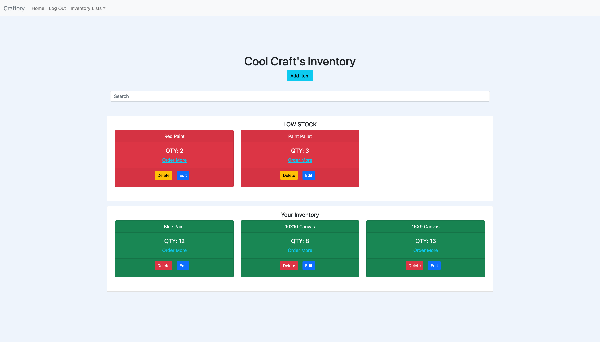

# craftory

## Table of contents

- [Overview](#overview)
  - [The Project](#the-project)
  - [Screenshot](#screenshot)
  - [Links](#links)
- [My process](#my-process)
  - [Built with](#built-with)
  - [What I learned](#what-i-learned)
  - [Continued development](#continued-development)
  - [Useful resources](#useful-resources)
- [Author](#author)
- [Acknowledgments](#acknowledgments)

## Overview

### The project

TODO

### Screenshot

### Links

- Live Site URL: [Here](https://calm-wave-18798.herokuapp.com/)

## My process

### Built with

- MongoDb
- Express
- React
- Node.js
- Bootstrap
- Passport.js
- Mongoose

### What I learned

TODO

### Continued development

TODO

## Author

- Website - [Curtis Gray](https://www.curtisgray.dev)
